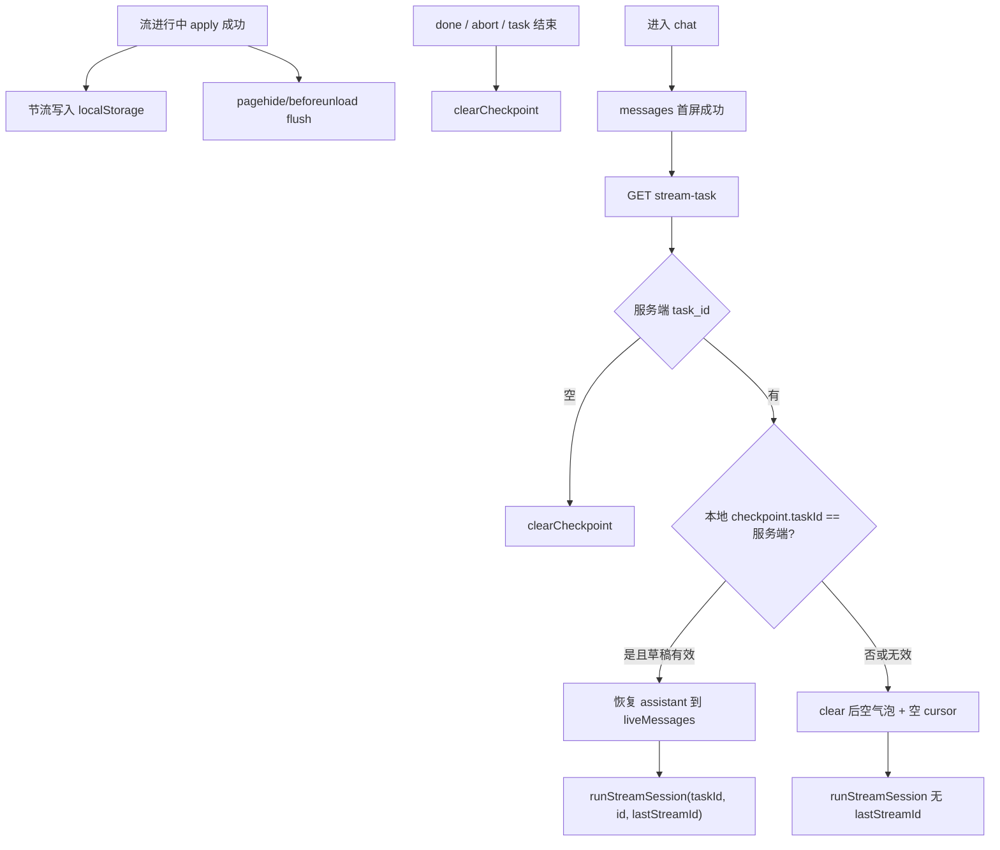

# Chat Stream Checkpoint (localStorage)

日期：2026-08-29  
状态：已实现（localStorage checkpoint + resume 对齐）

## 背景

前端已支持进入 chat 后查询 `GET /chats/:id/stream-task` 并复用 `runStreamSession` 恢复 SSE。当前恢复路径始终插入**空** assistant 气泡，且不带 `last_stream_id`，因此：

- 会从 Redis Stream 起点（或空 cursor）重拉事件，或在断线后缺少已展示内容的本地真相；
- 刷新后已生成的 thinking/正文容易闪断或需整段重放。

后端 SSE 已支持 `last_stream_id`（Redis `XREAD` 从该 id **之后**续读）。前端 `runStreamSession` 内存中已维护 `lastStreamId`，但未持久化。

## 目标

在 **localStorage** 中为每个 chat 持久化流式断点与已还原的 assistant 草稿，使得再次进入时：

1. 先拉完 messages；
2. 再查 `stream-task`；
3. 若服务端 `task_id` 与本地缓存一致：恢复草稿 UI，并以缓存的 `lastStreamId` 续 SSE；
4. 若不一致、无服务端任务、或无有效缓存：清理陈旧数据，走空气泡 / 无断点路径（或无操作）。

做到内容不缺失、不因重放而重叠。

## 非目标

- 不改后端协议或 Redis Stream 语义
- 不跨用户/跨设备同步
- 不解决多 Tab 实时协同（后写覆盖即可）
- 不把 user 消息写入 checkpoint（history 已覆盖）
- 不引入 IndexedDB / 新依赖

## 决策摘要

| 项 | 选择 |
|---|---|
| 存储 | `localStorage`（关浏览器仍可续） |
| 内容 | **断点 + 完整 assistant 草稿**（方案①） |
| Key | `gonotelm:chat-stream-checkpoint:${chatId}` |
| 写入时机 | 事件 apply 成功后节流写；`pagehide`/`beforeunload` flush |
| task 对齐 | 必须与 `stream-task` 返回的 `task_id` 一致才恢复草稿+断点 |
| 清理 | 流 terminal / abort / 服务端无 task / task 不一致 / 恢复失败 |
| 体积保护 | 序列化后超过约 1MB 则跳过该次写入 |

## 数据模型

```ts
interface ChatStreamCheckpoint {
  version: 1
  chatId: string
  taskId: string
  lastStreamId: string
  assistantMessage: ChatUiMessage
  updatedAt: number
}
```

- `lastStreamId`：已成功 apply 的最后一条流事件 id（与现有 `streamEvent.id` 一致）。
- `assistantMessage`：`applyStreamEventInPlace` 之后的 UI 快照（含 fragments / citations 等），续传时作为 live 草稿基底。

模块建议：`src/components/notebook-workspace/panel/chat/chatStreamCheckpoint.ts`  
导出：`loadCheckpoint` / `saveCheckpoint` / `clearCheckpoint` / `isCheckpointMatchingTask`（或等价 API）。

## 架构与数据流



## 与现有 resume 合并

在 `useChatConversation` 现有「messages 成功 → stream-task → resume」流程上扩展：

| 条件 | 行为 |
|---|---|
| 无 running task | `clearCheckpoint(chatId)`，结束 |
| 有 task + checkpoint 匹配 | 用缓存 `assistantMessage` 填 live；`runStreamSession(..., { initialLastStreamId })` |
| 有 task + 无/不匹配 checkpoint | `clearCheckpoint`；空气泡；不带 `last_stream_id` |
| 流进行中 | 每次（节流）`saveCheckpoint` |
| 流正常结束 / abort / task-not-running 收尾 | `clearCheckpoint` |

`runStreamSession` 变更：

- 增加可选 `initialLastStreamId?: string`
- 若传入恢复用的已有 assistant 草稿，跳过「新建空 assistant」或改为使用已有 id/内容（与恢复路径对齐）
- onEvent：更新 `lastStreamId` 并在 apply 后调度 checkpoint 保存

发送新消息创建 task 时：先 `clearCheckpoint` 再按新 task 写入，避免串 task。

## 重叠 / 缺失防护

| 风险 | 处理 |
|---|---|
| 事件重复 | XREAD 从 `lastStreamId` 之后读；仅 apply 成功后推进并落盘 id |
| 前文缺失 | 恢复完整 `assistantMessage` 再续 |
| 与 history 重复 | 现有 `displayMessages` 按 message id 去重；结束后 refetch history 并 clear |
| 陈旧 checkpoint | taskId 不一致或服务端无 task → clear |
| 半包写入 | apply 完成后再更新 id 与草稿；JSON 解析失败 → 视为无效并 clear |
| 超大草稿 | >1MB 跳过写入，该次刷新可能退化为空气泡+无断点 |

## 测试

- `chatStreamCheckpoint`：load/save/clear、version 不匹配、JSON 坏数据、task 匹配、超大跳过
- resume 路径（可用 mock storage）：匹配时带 `last_stream_id`；不匹配时 clear；无 task 时 clear
- 现有 chat API / conversation 测例保持绿色

## 错误与边界

| 场景 | 行为 |
|---|---|
| localStorage 不可用 / QuotaExceeded | 静默跳过写入，不挡聊天 |
| pagehide flush 失败 | 静默 |
| 多 Tab 同时写同一 chat | 后写覆盖；续传仍以服务端 task + lastId 为准 |
| checkpoint 中 assistant id 与后续流事件校正 | 沿用现有 reducer 改 id 行为，落盘用最新快照 |
