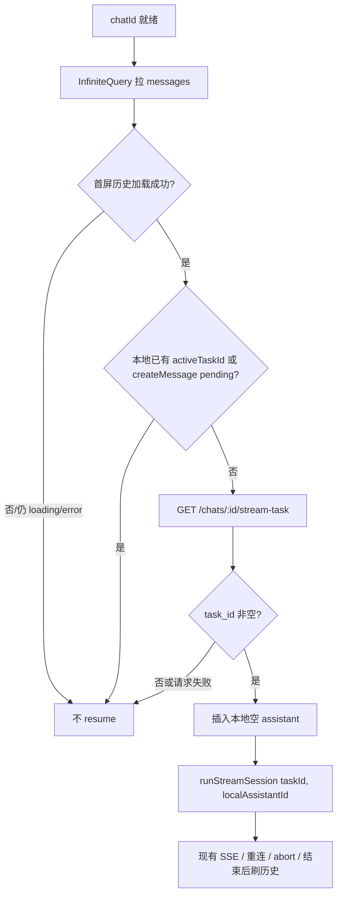

# Chat Stream Resume (Frontend)

日期：2026-08-29  
状态：已实现（web 端 resume）

## 背景

后端新增 `GET /api/v1/chats/:id/stream-task`，返回当前 chat 上仍在运行的流式任务 id：

- 有运行中任务：`{ "task_id": "<uuid>" }`
- 无任务：`{ "task_id": "" }`（HTTP 仍为成功）

前端发送消息后已有完整链路：`createMessage` → `runStreamSession(taskId, assistantMessageId)` → SSE。  
刷新或重新进入页面后，本地 `activeTaskId` 丢失，无法继续展示生成中状态。

## 目标

进入某个 chat 后：

1. **先**完成首屏 `listChatMessages` 加载；
2. **再**查询 `stream-task`；
3. 若 `task_id` 非空：插入一条本地空 assistant 气泡，并用该 `task_id` 调用现有 `runStreamSession` 接上 SSE，恢复任务显示；
4. 若为空或查询失败：不做任何额外处理（失败静默）。

## 非目标

- 不改后端接口或 stream 协议
- 不持久化 `last_stream_id`（刷新后从空 cursor 接流，依赖服务端 buffer）
- 不复用历史消息里可能存在的未完成 assistant（统一新建本地空气泡，由流事件校正 message id）
- 不做跨 tab / 跨设备同步
- 不拆独立 resume hook（逻辑落在 `useChatConversation`）

## 决策摘要

| 项 | 选择 |
|---|---|
| 范围 | 仅前端 `gonotelm-web` |
| 触发顺序 | 首屏 messages **成功加载后** 才查 running task |
| Assistant 气泡 | 新建本地空气泡（与发送后路径一致） |
| 流会话 | 复用现有 `runStreamSession` |
| Running task 查询失败 | 静默，不挡正常聊天 |
| 与发送竞态 | 本地已有 `activeTaskId` 或 `createMessage` pending 时跳过 resume |

## 架构与数据流



## API 层

`src/types/api.ts`：

```ts
export interface ChatGetRunningTaskResponse {
  task_id: string
}
```

`src/api/chat.ts`：

```ts
export function getChatRunningTask(chatId: string) {
  // GET /api/v1/chats/:id/stream-task
  return request<ChatGetRunningTaskResponse>(...)
}
```

## useChatConversation

在现有 hook 内增加 resume effect，依赖：`chatId`、`messagesQuery.isSuccess`（及必要的 pending/streaming 门闩）。

行为：

1. 无 `chatId` → return  
2. 首屏 messages 尚未 `isSuccess` → return  
3. 已有 `activeTaskId` 或 `createMessageMutation.isPending` → return  
4. 调用 `getChatRunningTask(chatId)`  
5. `task_id` 为空 → return  
6. 生成 `local-assistant-${Date.now()}`，写入 `liveMessages` + `activeAssistantMessageId`  
7. `await runStreamSession(taskId, assistantMessageId)`  

Cleanup（`chatId` 变化 / unmount）：

- 取消 in-flight 的 running-task 请求（AbortController）
- 已有 stream 生命周期仍由现有 `streamRunToken` / abort controller 处理，避免串流

历史与 live 去重：继续使用现有 `displayMessages` 按 message id 去重；流事件可更新 assistant id。

## Mock / 测试

- `chatHandlers` 增加 `GET .../stream-task`，默认返回 `{ task_id: "" }`
- API 层 mock 测试覆盖成功有 id / 空 id
- 可选：resume 门闩（messages 未成功前不请求）的轻量单测

## 错误与边界

| 场景 | 行为 |
|---|---|
| messages 加载失败 | 不 resume |
| stream-task 失败 | 静默，可继续聊天 |
| stream-task 返回空 | 无操作 |
| 用户正在发送 | 不 resume |
| 已在 streaming | 不 resume |
| 切换 chat | cleanup 取消 resume 请求；旧 stream 被 token/abort 失效 |
| 流正常结束 / abort | 沿用现有 `runStreamSession` 收尾与 history refetch |
